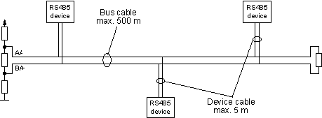

## Cloud, Edge, Fog computing
###### Cloudcomputing:
Infrastructure-as-a-Service (IaaS), Platform-as-a-Service (PaaS) and Software-as-a-Service (SaaS)
On-demand availability of computer system resources (data storage, computing power) on central servers
iCloud, Dropbox, online file converter, 
###### Edgecomputing:
Computation is moved away from the datacenter towards the edge of the network close to the consumer/user, to provide lower latency and smaller data transfers.
Traffic lights,
###### Fogcomputing:
Close to edge computing but the computation is even further out (after the gateway)

Example Winegrowing:
Fog: Measurement components are capturing Data and send them to a Edge centralized computing server which then sends the prepared and pre computed data to a central cloud storage

## RS485:
Automation, Industies 
 	| RS485
----|------	
Differential | yes
Max number of drivers | 32
Max number of receivers | 32
Modes of operation | half duplex 
Network topology | multipoint
Max distance (acc. standard) | 1200 m
Max speed at 12 m | 35 Mbs
Max speed at 1200 m	| 100 kbs
Max slew rate | n/a
Receiver input resistance | >= 12 kΩ
Driver load impedance | 54 Ω
Receiver input sensitivity | ±200 mV
Receiver input range | –7..12 V
Max driver output voltage | –7..12 V
Min driver output voltage (with load) | ±1.5 V

 
## RS232:
Terminal Modem, füher in PCs heute in Industrie und laborgeräten
15m 19,2kbs
900m 2,4bks

## I2C:
Serial 2 wire interfaces (Philips)
Low speed devices lcd displays or turning on power
10-400kbs lo distance 1-10m
Data transmission is established via slaves
Serial clock and serial data connection 
Low active

## SPI:
Serial peripheral interface, (Motorola)
Master slave used to tranfere data within microcontrollers, using 4 cables clock, slave/master i/o, select slave/master
Is optimized for 3m
Clock frequency <= Mhz

## Onewire:
16,3 kbs
Master slave use
15m
